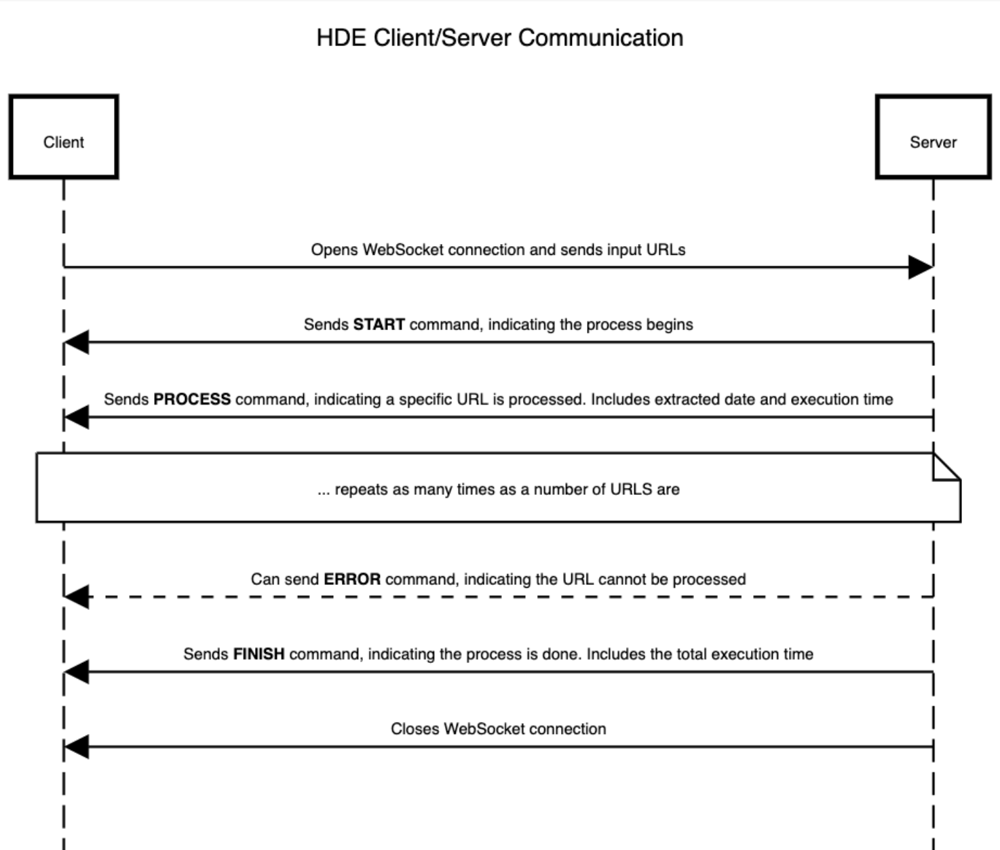

# HDE

HDE stands for **HTML Date Extractor**. A simple web app that can process HTTP URLs
in bulk and extract publication/modification dates from corresponding HTML pages.

## Usage & Development

``` sh
$ shards install
$ shards build --production
$ ./bin/hde
[development] Kemal is ready to lead at http://0.0.0.0:3000
```

## Deployment

App is deployed to [Heroku](https://www.heroku.com/). The following steps can be performed to deploy it from scratch:

``` sh
$ heroku create hde-kagi --buildpack https://github.com/crystal-lang/heroku-buildpack-crystal.git
$ heroku git:remote -a hde-kagi
$ git push heroku master
```

Also note, that in order to be able to use a cache storage, a Redis resource must be added.
Otherwise, cache must be disabled:

``` sh
$ heroku config:set CACHE_DISABLED=1
```

## How it works

### Client/Server communication

Client (browser) and Server(web server) are communicating using [WebSockets](https://developer.mozilla.org/en-US/docs/Web/API/WebSockets_API).
When user initiates a procedure to process the input URLs, the following is happening:



### Date extraction

Searching for a date in HTML is performed in the following steps:

1. Inspect the meta tags. Search is based on a whitelisted attributes which could indicate
the publication or modification date of the page.
2. Inspect the [JSON-LD](https://ru.wikipedia.org/wiki/JSON-LD) structure, which could contain
the publication or modification page of the page.
3. Inspect abbr attributes
4. Inspect the time fields
5. Try copyright date

You can check the [specs](spec/html_date_spec.cr) for examples.

### Caching

Cache is used to avoid time-consuming steps for URL extraction.
When the URL is processed for the first time and the date is successfully extracted,
it is being cached in Redis using two keys (stored in transaction mode):

* `digest-${url}` - the base64digest representation of the content available by the URL
* `date-${url}` - the extracted date

When the same URL is processed for the second time, few operations are performed:

1. Lookup for a date in the cache using `date-${url}` key. Meaning if it is available, the URL was cached in the past.
2. `LastModifiedAt` response header is compared with the current date, meaning if the content was not modified, we can use the cached value.
3. Calculate the base64digest for the content and compare with a cached value available by `digest-${url}`.
Meaning if the values are equal, content was not changed and we can used the cached value.

If none of the above steps are true, the app starts extracting the date.

Cache can be disabled by using `CACHE_DISABLED=1` environment variable.

## Contributors

- [Vitalii Elenhaupt](https://github.com/veelenga) - creator and maintainer
